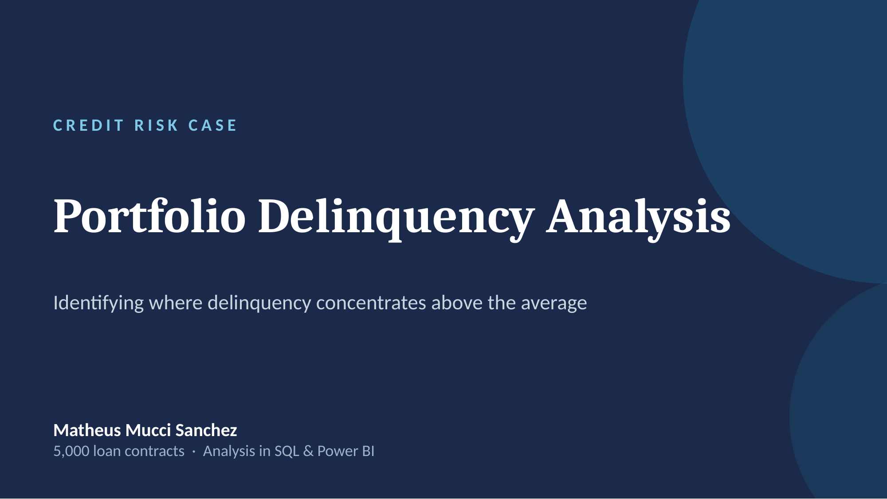
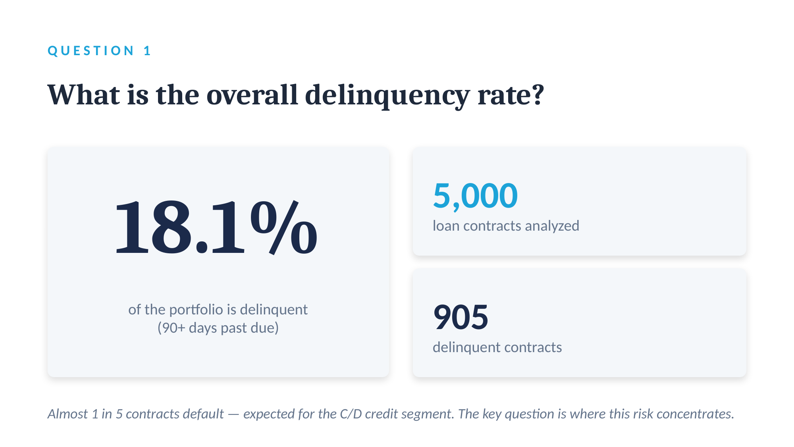
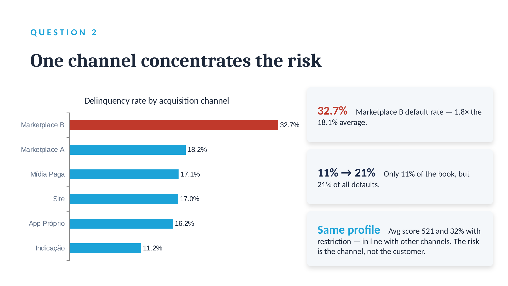
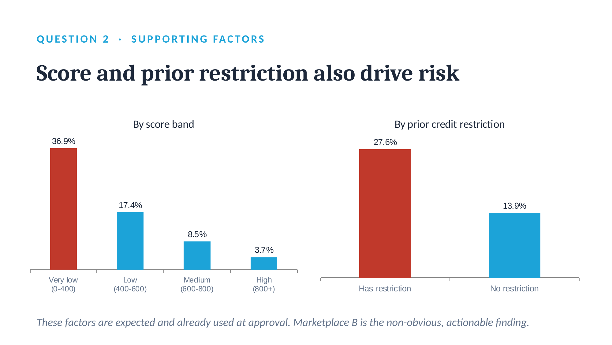
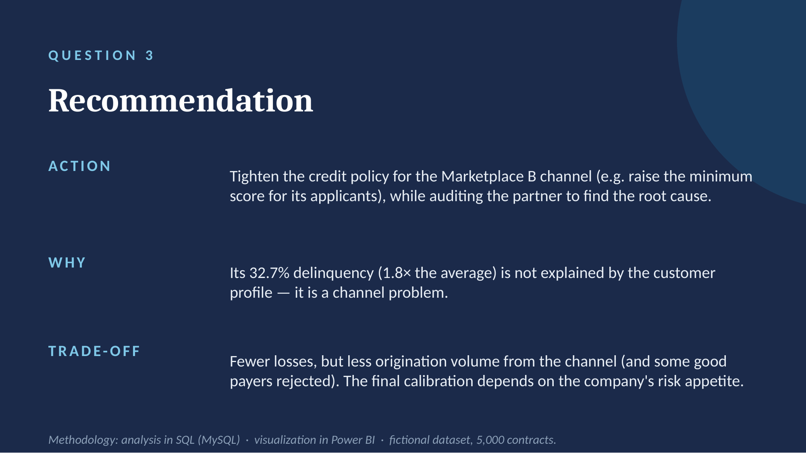

# Análise de Inadimplência de Carteira de Crédito

Análise de uma carteira de 5.000 contratos de empréstimo para identificar onde a inadimplência se concentra e recomendar uma ação de negócio.

**Ferramentas:** SQL (MySQL) para a análise · Power BI para a visualização
**Contexto:** case técnico de processo seletivo em uma fintech de crédito · base fictícia fornecida no case

---

## O problema

A carteira analisada atende o público das classes C/D, um segmento estruturalmente mais arriscado. A pergunta não era *"a inadimplência está alta?"* — e sim **onde ela se concentra e o que dá para fazer a respeito**.

Três perguntas guiaram o trabalho:

1. Qual a taxa geral de inadimplência da carteira?
2. Existe um segmento com inadimplência claramente acima da média?
3. Que recomendação de negócio decorre disso — e qual o trade-off?

## Os dados

| | |
|---|---|
| Registros | 5.000 contratos |
| Variáveis | 21 (perfil do cliente, score interno, canal de aquisição, condições do contrato, flag de inadimplência) |
| Definição de inadimplência | `inadimplente_90d` — atraso de 90 dias ou mais |
| Origem | Base fictícia fornecida no case |

**Tratamento aplicado:** ajuste de *encoding* (`latin1`) na importação do CSV, para corrigir a acentuação das colunas textuais `finalidade` e `regiao`. As colunas usadas nas análises não possuem acento, portanto não houve impacto nos resultados.

## Método

Toda a análise foi feita em SQL. A lógica central é simples e se repete: como `inadimplente_90d` é binária (0/1), **a média da coluna equivale à taxa de inadimplência** — o que permite calcular a taxa de qualquer recorte com um `AVG` combinado a um `GROUP BY`.

```sql
-- Taxa de inadimplência por canal de aquisição
SELECT
    canal_aquisicao,
    COUNT(*) AS total_contratos,
    ROUND(AVG(inadimplente_90d) * 100, 1) AS taxa_inadimplencia_pct
FROM emprestimos
GROUP BY canal_aquisicao
ORDER BY taxa_inadimplencia_pct DESC;
```

O código completo e comentado está em [`delinquency_analysis.sql`](delinquency_analysis.sql).

---

## Resultados




### 1. A taxa geral é de 18,1%

905 de 5.000 contratos. Um número alto em termos absolutos, mas coerente com o público C/D — não é um erro na carteira, é a realidade do modelo de negócio. Por isso a média isolada diz pouco: ela não indica onde agir.



### 2. Um canal concentra o risco

Quebrando a carteira por canal de aquisição, um deles se descola dos demais:

| Canal | Taxa de inadimplência |
|---|---|
| **Marketplace B** | **32,7%** |
| Marketplace A | 18,2% |
| Mídia Paga | 17,1% |
| Site | 17,0% |
| App Próprio | 16,2% |
| Indicação | 11,2% |



O Marketplace B tem **1,8x a taxa média da carteira** — e com 569 contratos, volume suficiente para o resultado não ser ruído amostral. O número que dimensiona o impacto: o canal representa **11% dos contratos, mas responde por 21% de todos os defaults**.

### 3. Não é o cliente — é o canal

Este foi o ponto que mudou a recomendação.

A explicação intuitiva para um canal ruim seria "ele atrai clientes de perfil pior". Os dados dizem o contrário: **o score médio e a taxa de clientes com restrição no Marketplace B estão em linha com os demais canais.** Mesmo perfil de risco na entrada, o dobro do calote na saída.

Isso desloca a hipótese do cliente para o canal — qualidade do tráfego, comportamento do parceiro ou fricção do fluxo de originação.

### Fatores de contexto



Duas variáveis se comportam como esperado e funcionam como controle da análise:

- **Faixa de score:** gradiente limpo de 36,9% (score 0–400) até 3,7% (800+)
- **Restrição prévia:** 27,6% com restrição contra 13,9% sem

Ambas já estão precificadas na aprovação. O achado do canal é o que **não** estava.

---

## Recomendação

**Ação:** apertar a régua de crédito especificamente para o Marketplace B — elevar o score mínimo de entrada para o canal — e, em paralelo, auditar o parceiro para investigar a causa raiz.

**Por quê:** 32,7% contra 18,1% da média é uma diferença que o perfil do cliente não explica. É um problema de canal, e problemas de canal se resolvem no canal.

**Trade-off assumido:** menor perda por inadimplência, ao custo de menor volume de originação e da rejeição de bons pagadores. A calibragem final depende do apetite a risco da companhia — a análise entrega a direção, a decisão do quanto é do negócio.



---

## O que eu tiraria deste projeto

O trabalho analítico mais valioso não foi a query mais complexa. Foi ter perguntado **"e se não for o cliente?"** antes de escrever a recomendação. Sem esse passo, a conclusão natural seria recalibrar o modelo de risco — uma ação cara e que não resolveria nada, porque o problema não estava ali.

---

## Estrutura do repositório

```
├── README.md
├── delinquency_analysis.sql    # todas as queries, comentadas
└── imagens/                     # visualizações do dashboard
```

---

## Summary (EN)

Analysis of a 5,000-contract loan portfolio to locate where delinquency concentrates. Overall rate: **18.1%**. One acquisition channel stands out at **32.7%** — 1.8x the portfolio average — while accounting for 11% of contracts but 21% of all defaults. Critically, its customer risk profile (internal score, prior credit restriction) is in line with every other channel, which points to the channel itself rather than the customer. Recommendation: a channel-specific credit policy plus a partner audit, with the trade-off of reduced origination made explicit. Built with SQL and Power BI on a fictional dataset.

---

**Matheus Mucci Sanchez** · [LinkedIn](https://github.com/matheussanchezsabbath-maker) · [Outros projetos](https://github.com/matheussanchezsabbath-maker)
